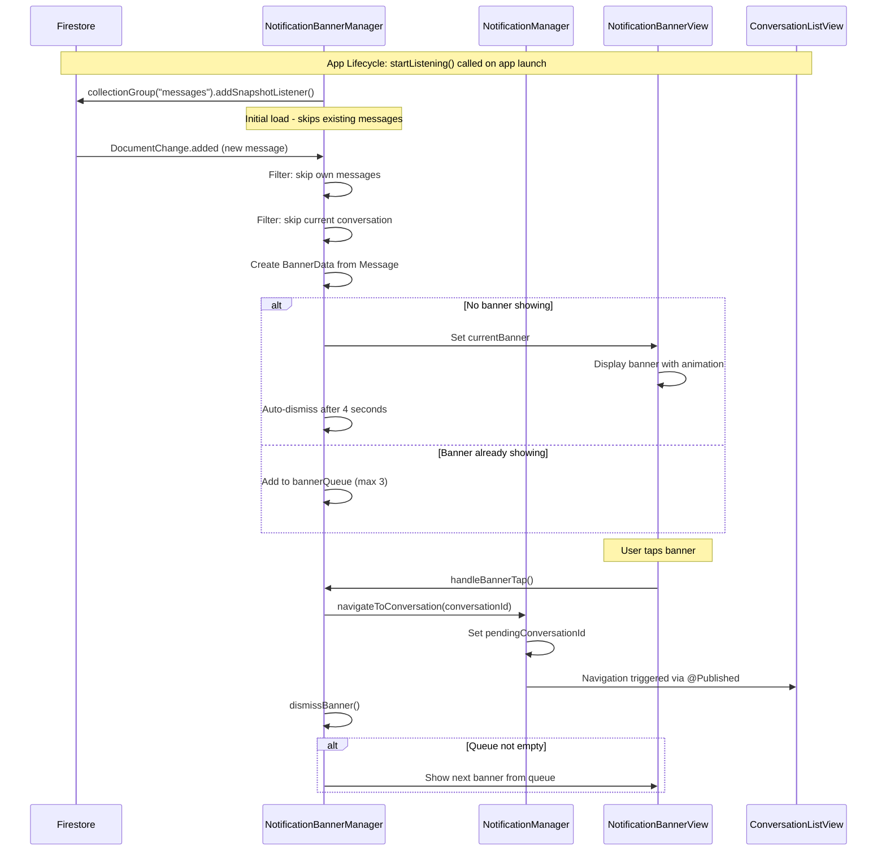
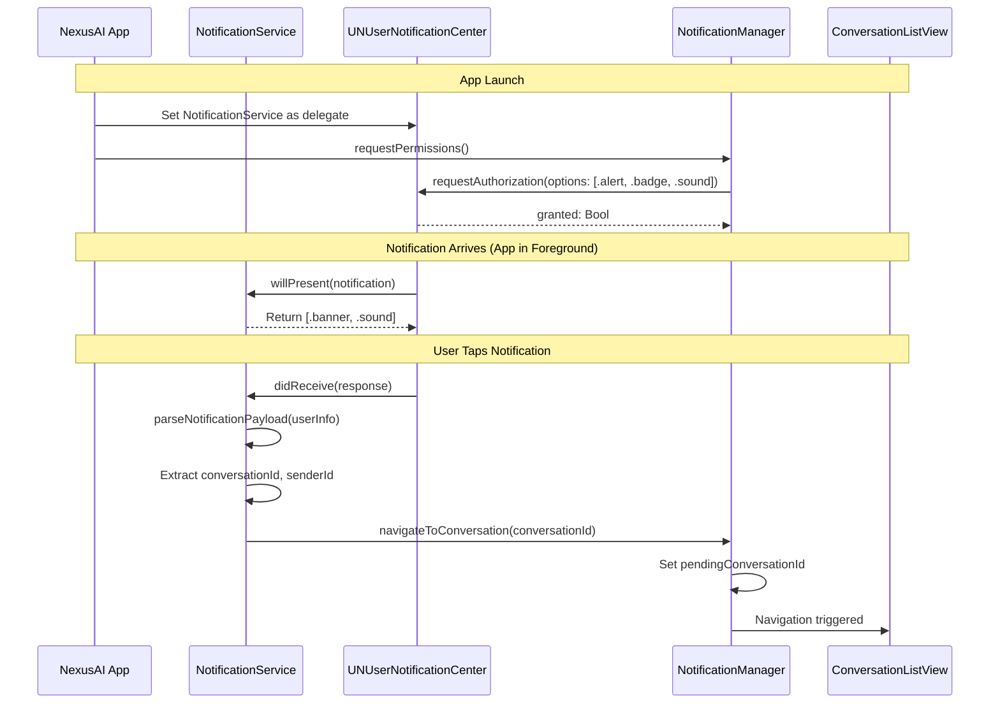
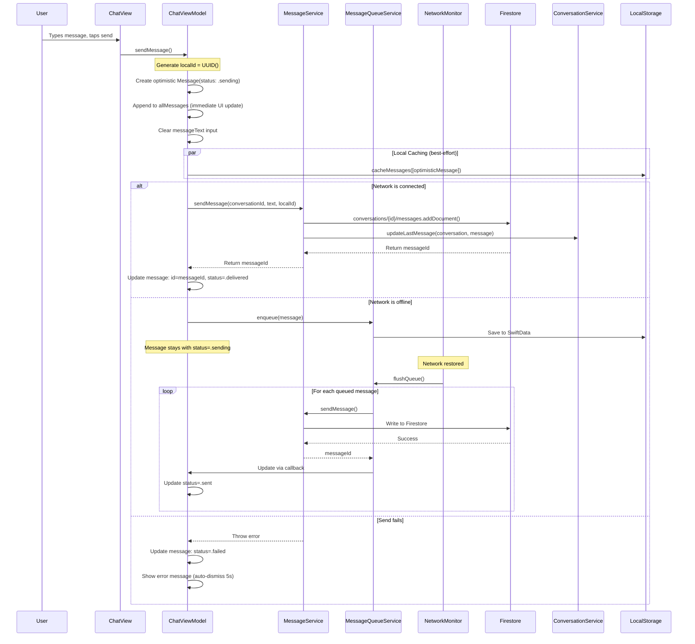
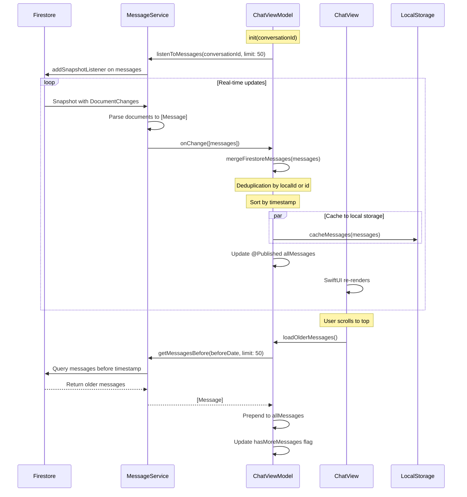
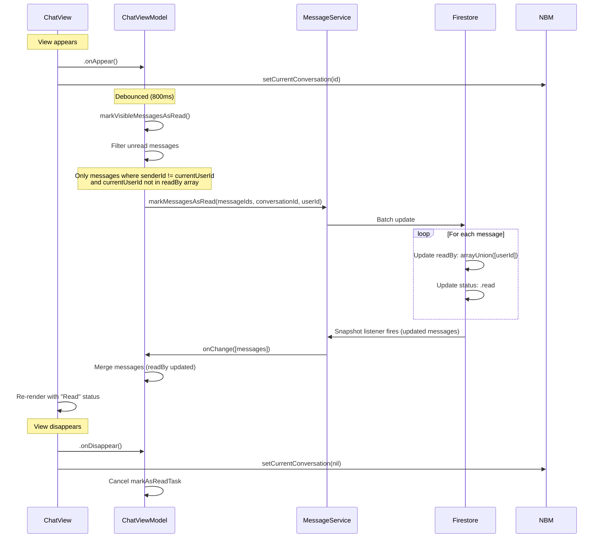
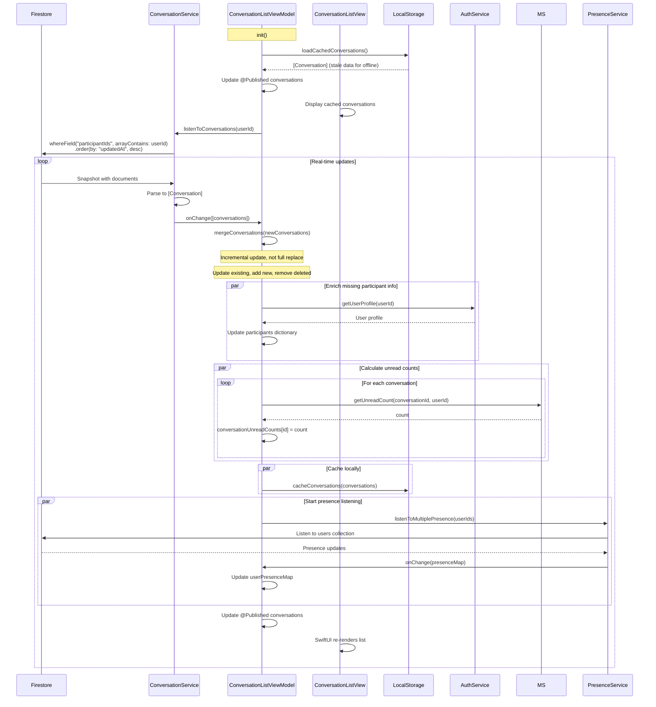
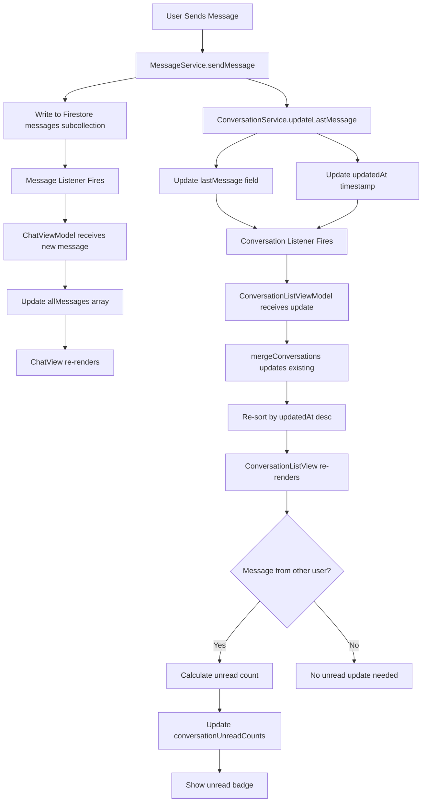
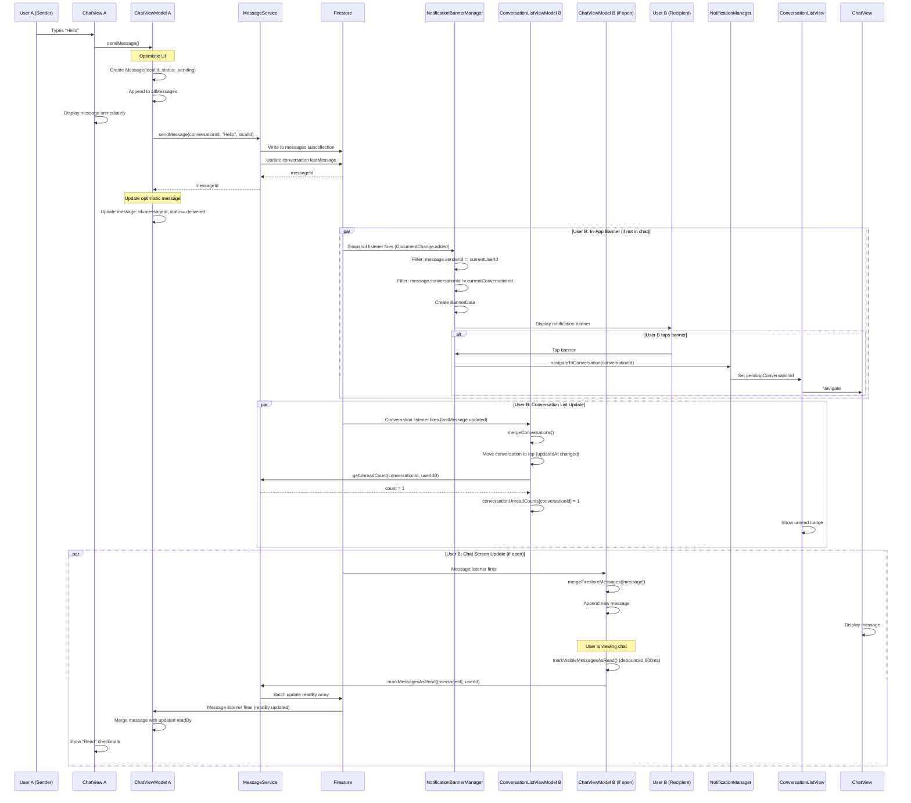

# NexusAI Architecture & Data Flow Overview

**Created:** October 22, 2025  
**Focus:** Notifications, Messages, and Conversation Updates

## Table of Contents
1. [System Architecture Overview](#system-architecture-overview)
2. [Notification System](#notification-system)
3. [Message System](#message-system)
4. [Conversation Update System](#conversation-update-system)
5. [Integration & Data Flow](#integration--data-flow)
6. [Key Design Patterns](#key-design-patterns)

---

## System Architecture Overview

### High-Level Architecture

```
┌─────────────────────────────────────────────────────────────────┐
│                         PRESENTATION LAYER                       │
│  ┌──────────────┐  ┌──────────────┐  ┌──────────────────────┐ │
│  │  ChatView    │  │ConversationList│ │NotificationBannerView│ │
│  │              │  │    View       │  │                      │ │
│  └──────────────┘  └──────────────┘  └──────────────────────┘ │
└─────────────────────────────────────────────────────────────────┘
                              ↕ @Published, @StateObject
┌─────────────────────────────────────────────────────────────────┐
│                         VIEW MODEL LAYER                         │
│  ┌──────────────┐  ┌────────────────────┐  ┌─────────────────┐│
│  │ChatViewModel │  │ConversationList    │  │ Notification    ││
│  │              │  │   ViewModel        │  │   Manager       ││
│  └──────────────┘  └────────────────────┘  └─────────────────┘│
│                    ┌─────────────────────────────────────────┐ │
│                    │  NotificationBannerManager (@MainActor)  │ │
│                    └─────────────────────────────────────────┘ │
└─────────────────────────────────────────────────────────────────┘
                              ↕ async/await, Combine
┌─────────────────────────────────────────────────────────────────┐
│                          SERVICE LAYER                           │
│  ┌───────────────┐  ┌──────────────┐  ┌───────────────────┐  │
│  │MessageService │  │Conversation  │  │NotificationService│  │
│  │               │  │   Service    │  │                   │  │
│  └───────────────┘  └──────────────┘  └───────────────────┘  │
│  ┌─────────────────────────────────────────────────────────┐  │
│  │        MessageQueueService (Offline Support)            │  │
│  └─────────────────────────────────────────────────────────┘  │
└─────────────────────────────────────────────────────────────────┘
                              ↕ Firestore SDK
┌─────────────────────────────────────────────────────────────────┐
│                         FIREBASE BACKEND                         │
│  ┌──────────────┐  ┌──────────────┐  ┌────────────────────┐  │
│  │  Firestore   │  │Firebase Auth │  │Firebase Cloud      │  │
│  │  Database    │  │              │  │Messaging (FCM)     │  │
│  └──────────────┘  └──────────────┘  └────────────────────┘  │
└─────────────────────────────────────────────────────────────────┘
```

---

## Notification System

The notification system has **two distinct subsystems**:
1. **In-App Notifications** (NotificationBannerManager) - Active now
2. **Push Notifications** (NotificationService/FCM) - Architecture in place, FCM integration pending

### 1. In-App Notification Banner Flow



**Key Components:**

**NotificationBannerManager** (`@MainActor`, `ObservableObject`)
- **Purpose:** Manages in-app notification banners for messages received while app is active
- **Lifecycle:** Initialized in `NexusAIApp`, starts listening after Firebase initialization
- **Firestore Listener:** `collectionGroup("messages")` - listens to ALL messages across all conversations
- **Published Properties:**
  - `currentBanner: BannerData?` - Currently displayed banner
  - `bannerQueue: [BannerData]` - Queue of pending banners (max 3)
- **Filtering Logic:**
  - Skip initial load (avoid banners for existing messages)
  - Skip own messages (`message.senderId != currentUserId`)
  - Skip messages in currently open conversation (`message.conversationId != currentConversationId`)
- **Banner Display:**
  - Auto-dismiss after 4 seconds
  - Queue management: FIFO, max 3 pending
  - Tap to navigate: Coordinates with NotificationManager
- **Conversation Tracking:** `setCurrentConversation(id:)` updates filter to suppress banners

**NotificationManager** (`@MainActor`, `ObservableObject`)
- **Purpose:** Coordinates notification navigation and permissions
- **Published Properties:**
  - `pendingConversationId: String?` - Triggers navigation when set
  - `authorizationStatus: UNAuthorizationStatus` - Current notification permission state
- **Methods:**
  - `requestPermissions()` - Request notification permissions
  - `navigateToConversation(conversationId:)` - Set pending navigation
  - `clearPendingNavigation()` - Clear after navigation handled

**BannerData Model**
```swift
struct BannerData {
    let id: UUID
    let conversationId: String
    let senderId: String
    let senderName: String
    let messageText: String
    let profileImageUrl: String?
    let timestamp: Date
    
    // Truncates text to 50 characters for display
    var displayText: String
}
```

**Integration Points:**
- **NexusAIApp:** Creates NotificationBannerManager and NotificationManager as @StateObject
- **ConversationListView:** Observes `pendingConversationId`, navigates to ChatView when set
- **ChatView:** Calls `setCurrentConversation()` on appear/disappear to suppress banners

### 2. Push Notification Flow (Architecture Ready)



**Key Components:**

**NotificationService** (`UNUserNotificationCenterDelegate`)
- **Purpose:** Handle push notification delegate methods
- **Delegate Methods:**
  - `willPresent(notification)` - Show banner even when app is foreground
  - `didReceive(response)` - Handle notification tap
- **Payload Parsing:**
  ```swift
  func parseNotificationPayload(_ userInfo: [AnyHashable: Any]) -> (conversationId: String?, senderId: String?)
  ```
  Expected payload:
  ```json
  {
    "conversationId": "abc123",
    "senderId": "user456",
    "senderName": "Alice",
    "messageText": "Hello!"
  }
  ```
- **Navigation:** Coordinates with NotificationManager via `navigateToConversation()`

**Future: Firebase Cloud Messaging Integration**
- FCM Token registration (when user logs in)
- Cloud Function to send push notifications on new messages
- APNs integration for iOS push delivery
- Simulator testing via `.apns` files

---

## Message System

### Message Sending Flow (Optimistic UI)



**Key Components:**

**ChatViewModel** (`@MainActor`, `ObservableObject`)
- **Purpose:** Manages chat screen state and message operations
- **Published Properties:**
  - `allMessages: [Message]` - All messages in conversation (optimistic + Firestore)
  - `messageText: String` - Input field binding
  - `isOffline: Bool` - Network connectivity status
  - `conversation: Conversation?` - Current conversation details
- **Message Sending Logic:**
  1. **Optimistic Update:** Create `Message` with `localId`, status `.sending`, append to `allMessages`
  2. **Network Check:** Query `NetworkMonitor.shared.isConnected`
  3. **Online Path:** Call `MessageService.sendMessage()`, update with real ID and `.delivered` status
  4. **Offline Path:** Call `MessageQueueService.enqueue()`, keep `.sending` status
  5. **Error Handling:** Update status to `.failed`, show user-friendly error message
- **Message Retry:** `retryMessage(localId:)` re-attempts sending failed messages

**MessageService**
- **Purpose:** Firestore message operations
- **Key Method:** `sendMessage(conversationId, text, senderId, senderName, localId) async throws -> String`
  - Writes message to `conversations/{id}/messages` subcollection
  - Sets `status: .delivered` immediately (optimistic delivery)
  - Sets `deliveredTo: [all participants]` (all participants get message once written)
  - Sets `readBy: [senderId]` (sender has "read" their own message)
  - Uses `FieldValue.serverTimestamp()` for accurate ordering
  - Returns Firestore-generated message ID
  - Calls `ConversationService.updateLastMessage()` to update conversation preview

**MessageQueueService** (Singleton)
- **Purpose:** Queue messages when offline, flush when online
- **Storage:** SwiftData for persistence
- **Methods:**
  - `enqueue(message: Message)` - Add to queue
  - `flushQueue() async -> [FlushResult]` - Send all queued messages sequentially
- **Integration:** NetworkMonitor triggers flush on reconnection

**Message Model**
```swift
struct Message: Codable, Identifiable {
    @DocumentID var id: String?           // Firestore ID (nil for optimistic)
    let conversationId: String
    let senderId: String
    let senderName: String
    let text: String
    let timestamp: Date
    var status: MessageStatus             // .sending, .sent, .delivered, .read, .failed
    var readBy: [String]                  // User IDs who read the message
    var deliveredTo: [String]             // User IDs who received the message
    var localId: String?                  // UUID for optimistic UI deduplication
    
    var displayStatus: MessageStatus      // Computed property: uses readBy/deliveredTo for real-time status
}

enum MessageStatus: String, Codable {
    case sending    // Optimistic UI, not yet sent
    case sent       // Written to Firestore, awaiting delivery confirmation
    case delivered  // Delivered to recipient(s)
    case read       // Read by at least one recipient
    case failed     // Send failed, needs retry
}
```

### Real-Time Message Sync Flow



**Key Mechanisms:**

**Real-Time Listener Setup:**
- **Trigger:** `ChatViewModel.init()` calls `startListeningToMessages()`
- **Firestore Query:**
  ```swift
  db.collection("conversations/{id}/messages")
    .order(by: "timestamp", descending: false)
    .limit(to: 50)
    .addSnapshotListener { snapshot, error in ... }
  ```
- **Listener Lifecycle:** Stored as `messageListener: ListenerRegistration?`, removed on `deinit` or `cleanupListeners()`

**Message Merging Logic (Deduplication):**
```swift
private func mergeFirestoreMessages(_ firestoreMessages: [Message]) {
    for firestoreMessage in firestoreMessages {
        if let existingIndex = allMessages.firstIndex(where: { existingMsg in
            // Match by localId first (optimistic message)
            if firestoreMessage.localId == existingMsg.localId { return true }
            // Match by id second (Firestore ID)
            if firestoreMessage.id == existingMsg.id { return true }
            return false
        }) {
            // Update existing message with Firestore data
            allMessages[existingIndex] = firestoreMessage
        } else {
            // New message - append
            allMessages.append(firestoreMessage)
        }
    }
    
    // Sort by timestamp
    allMessages.sort { $0.timestamp < $1.timestamp }
}
```

**Pagination:**
- **Initial Load:** Listener returns last 50 messages
- **Load Older:** Call `getMessagesBefore(beforeDate:)` on scroll to top
- **Cursor:** Use oldest message's timestamp as cursor
- **End Detection:** If fewer than 50 messages returned, set `hasMoreMessages = false`

### Message Status & Read Receipts



**Read Receipt Implementation:**

**Debouncing Strategy:**
- **Reason:** Prevent excessive Firestore writes when messages arrive rapidly
- **Delay:** 800ms after messages become visible
- **Mechanism:** `markAsReadTask: Task<Void, Never>?` cancelled on subsequent calls
- **Trigger:** `ChatView.onAppear()` calls `markVisibleMessagesAsRead()`

**Batch Update:**
```swift
func markMessagesAsRead(messageIds: [String], conversationId: String, userId: String) async throws {
    let batch = db.batch()
    
    for messageId in messageIds {
        let messageRef = db.collection("conversations/{id}/messages").document(messageId)
        batch.updateData([
            "readBy": FieldValue.arrayUnion([userId]),
            "status": MessageStatus.read.rawValue
        ], forDocument: messageRef)
    }
    
    try await batch.commit()
}
```

**Display Logic:**
```swift
// Message model computed property
var displayStatus: MessageStatus {
    if status == .sending || status == .failed { return status }
    
    // Check if read by anyone other than sender
    if readBy.contains(where: { $0 != senderId }) { return .read }
    
    // Check if delivered to anyone other than sender
    if deliveredTo.contains(where: { $0 != senderId }) { return .delivered }
    
    // If has Firestore ID, it's sent
    if id != nil { return .sent }
    
    return status
}
```

**Group Chat Read Receipts:**
- Display format: "Read by 3/5" or "Read by Alice, Bob"
- Uses `readBy` array to count participants who read the message
- Excludes sender from count

---

## Conversation Update System

### Conversation List Real-Time Sync



**Key Components:**

**ConversationListViewModel** (`@MainActor`, `ObservableObject`)
- **Purpose:** Manages conversation list state and operations
- **Published Properties:**
  - `conversations: [Conversation]` - All conversations for current user
  - `conversationUnreadCounts: [String: Int]` - Unread count per conversation
  - `userPresenceMap: [String: Bool]` - Online status per user
  - `searchText: String` - Filter input
- **Computed Properties:**
  - `filteredConversations` - Filters by search text (group name, participant names, last message)
- **Listener Setup:** `listenToConversations()` called in `init()`
- **Merge Strategy:** Incremental update to prevent unnecessary view re-renders
  ```swift
  private func mergeConversations(_ newConversations: [Conversation]) {
      for newConv in newConversations {
          if let existingIndex = conversations.firstIndex(where: { $0.id == newConv.id }) {
              conversations[existingIndex] = newConv  // Update in place
          } else {
              conversations.append(newConv)  // Add new
          }
      }
      // Remove conversations no longer in result
      // Sort by updatedAt descending
  }
  ```
- **Participant Enrichment:** Fetches missing participant info to fix "Unknown User" bug
- **Unread Count Calculation:** Queries `MessageService.getUnreadCount()` for each conversation
- **Presence Tracking:** Listens to presence for all conversation participants (limit 10 due to Firestore)

**ConversationService**
- **Purpose:** Firestore conversation operations
- **Key Methods:**
  - `createDirectConversation()` - Check for existing, create if not found
  - `createGroupConversation()` - Create group with participants
  - `getOrCreateDirectConversation()` - Convenience method for direct chats
  - `updateLastMessage()` - Update conversation preview when message sent
  - `listenToConversations(userId:)` - Real-time listener
- **Last Message Update:**
  ```swift
  func updateLastMessage(conversationId: String, message: Message) async throws {
      let lastMessage = Conversation.LastMessage(
          text: message.text,
          senderId: message.senderId,
          senderName: message.senderName,
          timestamp: message.timestamp
      )
      
      try await db.collection("conversations").document(conversationId).updateData([
          "lastMessage": try Firestore.Encoder().encode(lastMessage),
          "updatedAt": FieldValue.serverTimestamp()
      ])
  }
  ```

**Conversation Model**
```swift
struct Conversation: Codable, Identifiable, Hashable {
    @DocumentID var id: String?
    let type: ConversationType              // .direct or .group
    let participantIds: [String]
    var participants: [String: ParticipantInfo]  // userId -> {displayName, profileImageUrl}
    var lastMessage: LastMessage?
    var groupName: String?
    var groupImageUrl: String?
    var createdBy: String?
    let createdAt: Date
    var updatedAt: Date?
    var unreadCount: Int = 0                // Client-side only
    
    var isGroup: Bool { type == .group }
    
    struct ParticipantInfo: Codable, Hashable {
        let displayName: String
        let profileImageUrl: String?
    }
    
    struct LastMessage: Codable, Hashable {
        let text: String
        let senderId: String
        let senderName: String
        let timestamp: Date
    }
}
```

### Conversation Updates Trigger Chain



**Update Triggers:**
1. **Message Sent:** `MessageService.sendMessage()` → `ConversationService.updateLastMessage()`
2. **Last Message Updated:** Firestore `updatedAt` timestamp changes
3. **Conversation Listener Fires:** All users in conversation receive update
4. **ViewModel Merges:** Incremental update to `conversations` array
5. **View Re-renders:** SwiftUI detects `@Published` change
6. **Unread Count Recalculated:** `MessageService.getUnreadCount()` for each conversation

**Sorting Logic:**
- Conversations sorted by `updatedAt` (descending) - most recent first
- Fallback to `createdAt` if `updatedAt` is nil
- Firestore query already orders, but ViewModel ensures consistency

---

## Integration & Data Flow

### Complete Message Send → Notification Flow



### App Lifecycle & Listener Management

```
App Launch
    ↓
NexusAIApp.init()
    ↓
Create @StateObject instances:
    - AuthViewModel
    - NotificationManager
    - NotificationBannerManager
    ↓
Firebase configured (FirebaseService.shared)
    ↓
User authenticated? → No → Show LoginView
                    ↓ Yes
                    Show ConversationListView
                    ↓
                ConversationListViewModel.init()
                    ↓
                Start conversation listener
                    ↓
                NotificationBannerManager.startListening()
                    ↓
                Start global message listener

User navigates to ChatView
    ↓
ChatViewModel.init(conversationId)
    ↓
Start message listener for conversation
    ↓
ChatView.onAppear()
    ↓
markVisibleMessagesAsRead()
    ↓
NotificationBannerManager.setCurrentConversation(id)

User navigates back
    ↓
ChatView.onDisappear()
    ↓
NotificationBannerManager.setCurrentConversation(nil)
    ↓
ChatViewModel.cleanupListeners()
    ↓
Remove message listener

App backgrounded
    ↓
PresenceService.updatePresence(false) (after 5s delay)
    ↓
Firestore listeners persist
    ↓
Background sync continues (iOS limits apply)

App foregrounded
    ↓
PresenceService.updatePresence(true)
    ↓
Listeners resume
    ↓
UI updates with accumulated changes
```

---

## Key Design Patterns

### 1. Optimistic UI Pattern

**Implementation:**
- Create temporary message with `localId = UUID()` and `status = .sending`
- Append to `allMessages` array immediately
- UI updates instantly (no waiting for network)
- Background: Send to Firestore
- On success: Update message with real `id` and `status = .delivered`
- On failure: Update `status = .failed`, show retry button

**Benefits:**
- Instant feedback (WhatsApp-like UX)
- Works offline (messages queued)
- User continues typing while previous message sends

**Deduplication:**
```swift
// When Firestore message arrives, match by localId first
if firestoreMessage.localId == existingMessage.localId {
    // This is our optimistic message - update it
    existingMessage = firestoreMessage
}
```

### 2. Real-Time Listener Pattern

**Implementation:**
- Firestore `addSnapshotListener()` on collections/documents
- Listener fires immediately with current data
- Listener fires again on any change
- Callback updates ViewModel's `@Published` properties
- SwiftUI automatically re-renders views

**Lifecycle Management:**
```swift
class ChatViewModel {
    private var messageListener: ListenerRegistration?
    
    func startListening() {
        messageListener = db.collection("...").addSnapshotListener { snapshot, error in
            // Update @Published properties
        }
    }
    
    deinit {
        messageListener?.remove()
    }
}
```

**Memory Management:**
- Use `[weak self]` in closures to prevent retain cycles
- Remove listener in `deinit` or explicit `cleanup()` method
- Store `ListenerRegistration?` for cancellation

### 3. Offline-First Pattern

**Implementation:**
- Check `NetworkMonitor.isConnected` before operations
- If offline: Queue operation in `MessageQueueService` (SwiftData)
- If online: Execute immediately
- On reconnection: `NetworkMonitor` publishes change → `flushQueue()` called

**Message Queue:**
```swift
@MainActor
class MessageQueueService {
    func enqueue(message: Message) throws {
        // Save to SwiftData
    }
    
    func flushQueue() async -> [FlushResult] {
        let queued = getQueuedMessages()
        var results: [FlushResult] = []
        
        for message in queued {
            do {
                let messageId = try await messageService.sendMessage(...)
                removeFromQueue(message)
                results.append(.success(messageId, localId))
            } catch {
                results.append(.failure(error, localId))
            }
        }
        
        return results
    }
}
```

**User Experience:**
- Messages show "Sending..." status
- No blocking or error dialogs
- Automatic retry when online
- Queued messages persist across app restarts

### 4. Publisher-Subscriber Pattern

**Implementation:**
- ViewModels conform to `ObservableObject`
- Expose `@Published` properties
- Views observe with `@StateObject` or `@ObservedObject`
- SwiftUI automatically subscribes and re-renders on changes

**Example:**
```swift
@MainActor
class ChatViewModel: ObservableObject {
    @Published var allMessages: [Message] = []
    @Published var isOffline: Bool = false
}

struct ChatView: View {
    @StateObject private var viewModel: ChatViewModel
    
    var body: some View {
        List(viewModel.allMessages) { message in
            MessageBubbleView(message: message)
        }
        .overlay {
            if viewModel.isOffline {
                OfflineBanner()
            }
        }
    }
}
```

**Combine Integration:**
- Use `sink()` to observe other publishers (e.g., `NetworkMonitor.$isConnected`)
- Store `AnyCancellable` in `Set<AnyCancellable>`
- Cancellables automatically cancelled on deinit

### 5. Service Layer Abstraction

**Implementation:**
- Services encapsulate Firestore operations
- ViewModels call services, never touch Firestore directly
- Services return Swift models, not Firestore documents
- Use `async/await` for modern concurrency

**Example:**
```swift
// ❌ Bad: ViewModel directly accessing Firestore
class ChatViewModel {
    func sendMessage() {
        Firestore.firestore().collection("conversations/\(id)/messages").addDocument(...)
    }
}

// ✅ Good: ViewModel uses service
class ChatViewModel {
    private let messageService = MessageService()
    
    func sendMessage() async {
        try await messageService.sendMessage(conversationId, text, senderId, senderName, localId)
    }
}
```

**Benefits:**
- Testability: Mock services for unit tests
- Reusability: Multiple ViewModels use same service
- Maintainability: Change Firestore logic in one place
- Type safety: Services handle encoding/decoding

### 6. Debouncing Pattern

**Implementation:**
- Use `Task` with `sleep()` for time-based debouncing
- Cancel previous task on subsequent calls
- Prevents excessive API calls or Firestore writes

**Example:**
```swift
class ChatViewModel {
    private var markAsReadTask: Task<Void, Never>?
    
    func markVisibleMessagesAsRead() {
        // Cancel previous task
        markAsReadTask?.cancel()
        
        // Create new debounced task
        markAsReadTask = Task {
            // Wait 800ms
            try? await Task.sleep(nanoseconds: 800_000_000)
            
            // Check if cancelled
            guard !Task.isCancelled else { return }
            
            // Execute operation
            let messageIds = unreadMessages.compactMap { $0.id }
            try await messageService.markMessagesAsRead(messageIds, ...)
        }
    }
}
```

**Use Cases:**
- Read receipts: Debounce to prevent write on every message arrival
- Search: Debounce text input to avoid query on every keystroke
- Typing indicators: Debounce to prevent excessive updates

---

## Summary

### Notification System
- **In-App Banners:** Global `collectionGroup()` listener → filter → queue → display → navigate
- **Push Notifications:** Architecture ready, FCM integration pending

### Message System
- **Sending:** Optimistic UI → offline queue if needed → Firestore write → merge on listener update
- **Sync:** Real-time snapshot listeners → merge with deduplication → sort by timestamp
- **Status:** Computed from `readBy`/`deliveredTo` arrays, updated via batch writes

### Conversation System
- **List Sync:** Real-time listener → incremental merge → enrich participant info → calculate unread counts
- **Updates:** Message send → update `lastMessage` → trigger conversation listener → re-sort list
- **Presence:** Track online status for conversation participants (limit 10)

### Integration Points
1. **Message → Banner:** Firestore listener in NotificationBannerManager detects new messages
2. **Message → Conversation:** MessageService calls ConversationService.updateLastMessage()
3. **Navigation:** NotificationManager publishes `pendingConversationId`, ConversationListView observes and navigates
4. **Read Receipts:** ChatView lifecycle triggers markVisibleMessagesAsRead() → updates Firestore → listener propagates to sender

### Key Characteristics
- **Offline-First:** Message queue with auto-flush, local caching, optimistic UI
- **Real-Time:** Firestore snapshot listeners for instant updates
- **Scalable:** Service layer abstraction, protocol-based DI, incremental updates
- **Robust:** Debouncing, error handling, retry logic, memory management

